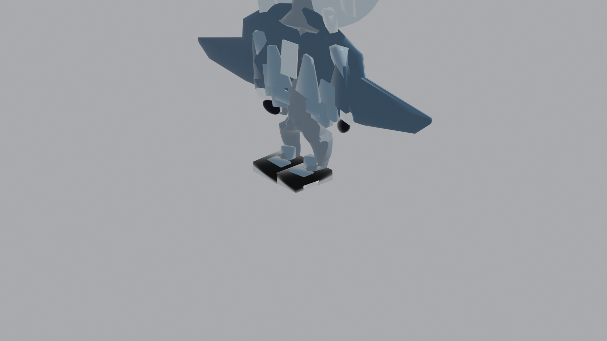
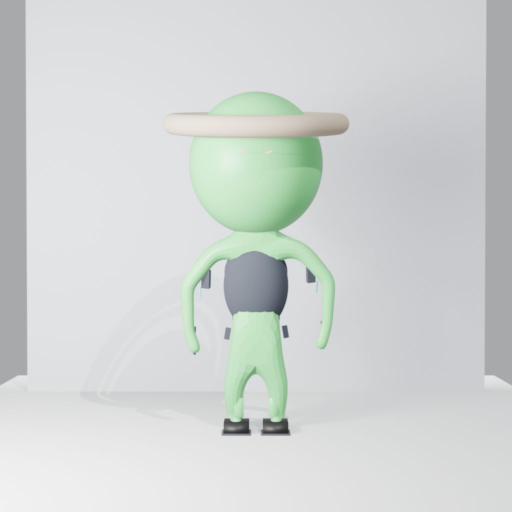
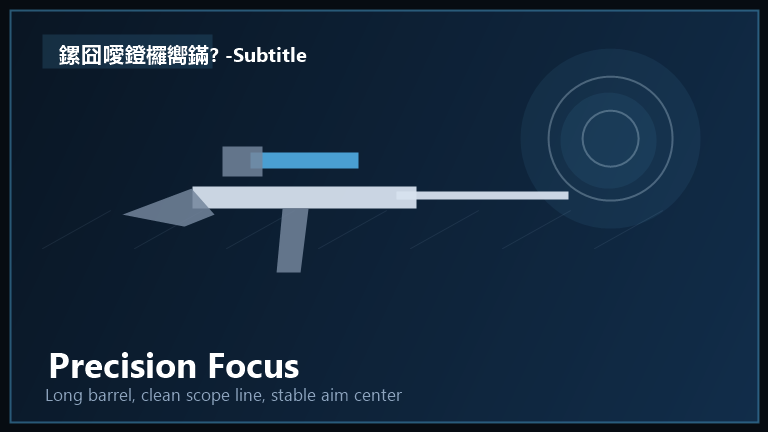

# 狙击外星人升级版

在 3D 城市场景里"找不同"——用狙击镜把伪装成人类的外星人从人群中揪出来。

## 这是什么

一款以**识别伪装目标**为核心玩法的 2.5D 狙击游戏。玩家在上帝视角的城市场景中扫描可疑角色，放大瞄准、屏息判断、开枪射击，在"观察—判断—确认"的循环里体验识别快感，而不是传统射击游戏的纯粹反应速度。

Godot 4.x 开发，3D 场景 + 2.5D 搜索镜头，当前主模式为 PVE 三关。

## 亮点

- 核心玩法不是"看见就开枪"，而是"先观察、再判断、再确认"——伪装外星人靠轮廓异常、材质破绽、弱点窗口暴露身份，平民也会制造假线索误导你
- 完整反馈闭环：命中 / 误伤 / 挡弹 / 脱靶各有独立视觉和音效反馈，误判后有复盘回放帮你理解"为什么错"
- 关卡配置驱动：目标类型、行为模式、伪装强度、移动范围都由配置文件控制，不写死在代码里
- 工程化资产管线：角色、掩体、武器、贴花、反馈层都有独立的接入规则、命名规范和验证清单
- 玩家手感与关卡难度分层：操作手感（镜头、缩放、屏息）和关卡难度（目标配置）严格分开调校

## 项目截图

| 角色模型 | 角色变体 | 武器 |
|---|---|---|
|  |  |  |

## 技术栈

- `Godot 4.x`（GDScript）
- `Jolt Physics` 3D 物理引擎
- `Blender` 3D 资产制作
- `Python` 辅助工具链（文档口径校准、资产接入合同生成、测试回归映射）
- Git LFS 管理大体积资源（`.glb` 模型、`.wav` 音频）

## 目录结构

| 目录 / 文件 | 说明 |
|---|---|
| `狙击外星人升级版/` | Godot 主工程，打开即跑 |
| `3d_asset_engineering/` | 3D 资产工程化规范：角色、掩体、贴花、反馈、武器、接入映射、验证结果 |
| `sniper-art-first-batch/` | 首批美术资产：武器卡图、角色识别卡、图标 |
| `sniper-art-second-batch/` | 第二批美术资产：特效、场景、HUD 组件 |
| `sniper-art-third-batch/` | 第三批美术资产：角色状态变体、伪装/弱点差分 |
| `sniper-game-asset-board/` | 资产总览板，快速浏览整体视觉方向 |
| `sniper-master-mobile-ui/` | 移动端界面方案与页面预览 |
| `cartoon-alien-hunt-assets/` | 卡通软 3D 方向素材试制 |
| `project-execution-retro/` | 文档口径、资产接入合同、测试回归映射工具 |
| `llm_proxy/` | LLM 代理服务（可选，主工程不依赖） |
| `blender_mcp/` | Blender MCP 集成与配置 |
| `GDD_狙击大师_完整设计方案.md` | 当前设计基线文档 |

## 快速运行

1. 安装 `Godot 4.x`
2. 安装 `Git LFS`，克隆后拉取大资源：`git lfs install && git lfs pull`
3. 用 Godot 打开 `狙击外星人升级版/` 目录
4. 等待资源导入完成，直接运行主工程

## 路线图

- **近期**：打磨识别玩法的可读性与反馈语义；稳定 3 关 PVE 的节奏、难度与复盘体验
- **中期**：占位资产切为量产资产管线；教程、成长与装备系统闭合局内体验和局外动力
- **远期**：PVP 骨架从预留推进到可验收；评估移动端/小程序/短视频平台适配

## 联系方式

- GitHub Issues：提需求、报问题、讨论方向
- 维护者：`<你的名字或团队名>`
- 邮箱：`<你的对外联系方式>`